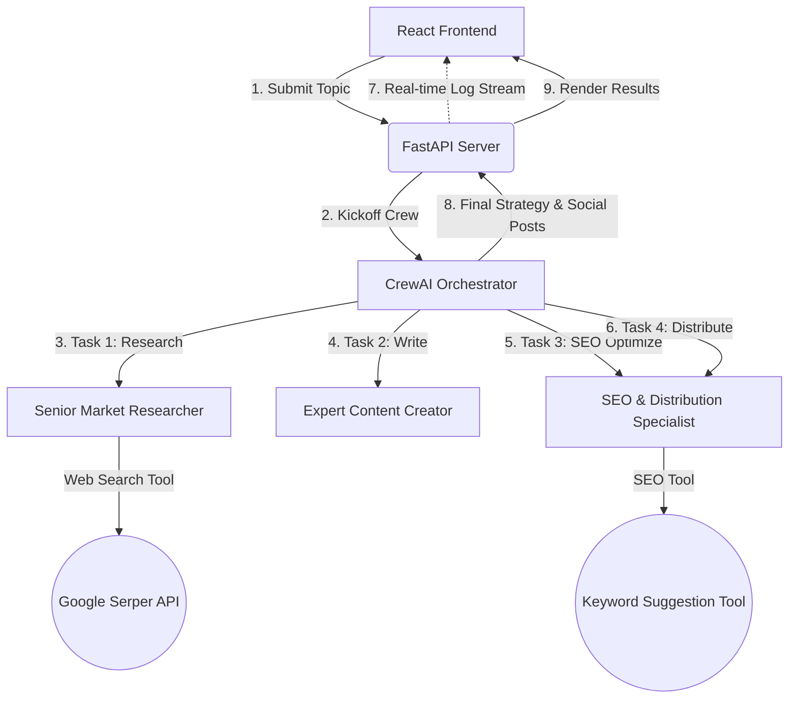

# Agentic Marketing Crew 🚀

A full-stack, multi-agent marketing campaign generator built using **CrewAI**, **FastAPI** (with real-time Server-Sent Events log streaming), and a premium **React/Vite** dashboard. 

The system automates the creation of marketing materials: it conducts market research, drafts blog posts, optimizes articles for SEO, and outlines a multi-channel social media distribution strategy.

---

## 🏗️ System Architecture & Workflow

The platform operates as a collaborative workflow of three specialized agents executing sequential tasks. As the agents run, their internal console logs are captured by the FastAPI server, cleaned of noise, and streamed in real-time to the React frontend terminal using a Server-Sent Events (SSE) stream.



---

## 🤖 Agents & Tools Breakdown

The system leverages three distinct agents configured in [main.py](file:///c:/Users/Anvay%20Sharma/Desktop/ai%20agent%20using%20crew%20ai/main.py):

### 1. Senior Market Researcher
*   **Goal**: Gather and analyze the latest market trends, competitor activities, and user needs regarding a topic.
*   **Backstory**: A seasoned analyst with an eye for detail who excels at filtering noise to find valuable market insights.
*   **Task**: Searches the web to compile a comprehensive market research report on the topic.
*   **Tools**:
    *   **Web Search Tool** (`search_tool`): Custom tool wrapped around the **Serper API** to fetch organic Google search results, snippets, and source links.

### 2. Expert Content Creator
*   **Goal**: Draft high-quality, engaging, and clear articles or reports based on market research.
*   **Backstory**: A creative writer who translates raw analytical data into compelling narratives.
*   **Task**: Writes a draft article (~800–1000 words) with clear headings tailored for a professional audience.
*   **Tools**: *None (Uses the outputs of the Market Researcher).*

### 3. SEO & Distribution Specialist
*   **Goal**: Optimize content for search engines and outline a multi-channel distribution strategy.
*   **Backstory**: A digital marketing guru who understands search engine algorithms and content distribution channels to maximize reach and conversion.
*   **Tasks**:
    *   **Refine**: Optimizes the draft article, inserts meta tags, and suggests heading updates.
    *   **Distribute**: Creates a strategic content distribution plan (LinkedIn/Facebook, Twitter, Instagram) with ready-to-post social copy.
*   **Tools**:
    *   **SEO Keyword Analysis Tool** (`seo_keyword_tool`): Custom tool that extracts high-traffic search terms and informational intent trends for the target topic.

---

## ⚡ Elevating Performance with Faster & Stronger LLMs

By default, the project is configured to run on a local **Ollama** instance with `llama3.2` (3B parameters):
*   **Pros**: 100% private, free, and runs locally.
*   **Cons**: Slower execution times (high latency), limited reasoning capacity, and occasional formatting errors in complex tasks (like JSON parsing or precise markdown structures).

To build a **highly performing, production-ready, and blazing-fast agent**, you can easily swap Ollama for cloud-hosted LLM providers like **OpenAI (GPT-4o)**, **Groq (hosted Llama-3.3-70B)**, or **Google Gemini (Gemini-1.5-Flash)**.

### 1. Update your `.env` file
Add your API keys to the root `.env` file:

```ini
# --- OpenAI (Best Reasoning & Structure) ---
OPENAI_API_KEY=your_openai_api_key_here

# --- Groq (Blazing Fast Inference) ---
GROQ_API_KEY=your_groq_api_key_here

# --- Google Gemini (Fast & Highly Cost-Effective) ---
GEMINI_API_KEY=your_gemini_api_key_here
```

### 2. Modify LLM Initialization in [main.py](file:///c:/Users/Anvay%20Sharma/Desktop/ai%20agent%20using%20crew%20ai/main.py)
Update the `create_marketing_crew()` function to initialize the LLM wrapper of your choice:

```python
from crewai import LLM

# Option A: OpenAI GPT-4o-mini (Extremely smart, fast, and structured)
llm = LLM(
    model="gpt-4o-mini",
    temperature=0.2
)

# Option B: Groq Llama 3.3 70B (Unbelievably fast execution speed)
# Make sure to run: pip install langchain-groq
llm = LLM(
    model="groq/llama-3.3-70b-specdec",
    temperature=0.1
)

# Option C: Google Gemini 1.5 Flash (Great balance of speed and cost)
llm = LLM(
    model="gemini/gemini-1.5-flash",
    temperature=0.2
)
```

Apply the new `llm` instance to the agents:
```python
market_researcher = Agent(
    role="Senior Market Researcher",
    ...,
    llm=llm
)

content_creator = Agent(
    role="Expert Content Creator",
    ...,
    llm=llm
)

marketing_specialist = Agent(
    role="SEO and Distribution Specialist",
    ...,
    llm=llm
)
```

---

## 🚀 Getting Started

### Backend Setup (FastAPI)
1.  Navigate to the root directory.
2.  Install dependencies:
    ```bash
    pip install fastapi uvicorn crewai crewai-tools python-dotenv requests
    ```
3.  Configure your keys in the `.env` file (e.g., `SERPER_API_KEY`).
4.  Start the FastAPI backend server:
    ```bash
    python server.py
    ```
    The server will run on `http://127.0.0.1:8000`.

### Frontend Setup (Vite + React)
1.  Navigate to the `frontend` folder:
    ```bash
    cd frontend
    ```
2.  Install packages:
    ```bash
    npm install
    ```
3.  Run the development server:
    ```bash
    npm run dev
    ```
4.  Open `http://localhost:5173` in your browser to access the dashboard.
